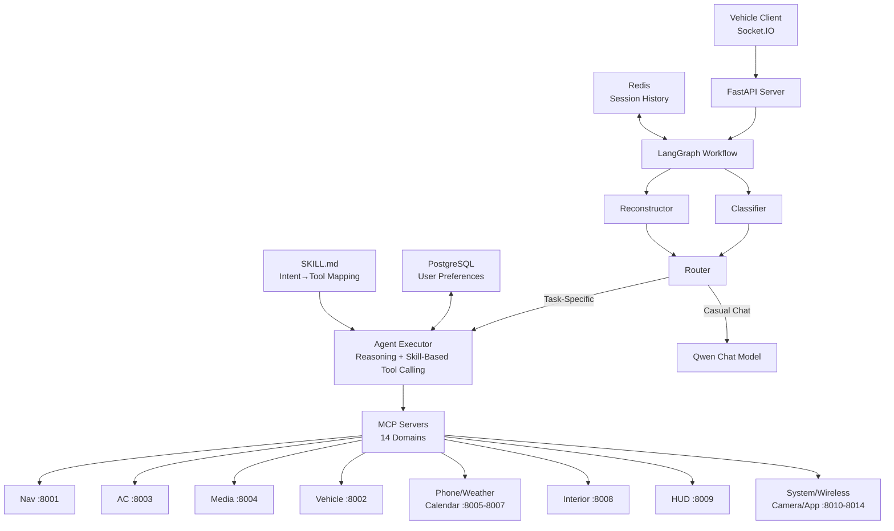

# Vehicle Embedded Multi-Task Voice Assistant System

A real-time vehicle voice assistant system that processes natural language queries from drivers and passengers, routing them to appropriate domain-specific agents for execution via the Model Context Protocol (MCP).

## Project Overview

This system enables hands-free voice control of vehicle functions including navigation, climate control, media playback, and more. It uses a multi-agent architecture with LLM-powered intent classification, query reconstruction, and intelligent routing.

### Key Features

- **Multi-turn Conversation**: Maintains context across conversation turns using Redis-based history storage
- **Query Reconstruction**: Resolves pronouns, ellipsis, and anaphora using conversation history
- **Intelligent Routing**: Classifies queries as casual chat or task-specific, then routes to appropriate agent
- **Real-time Streaming**: Supports streaming responses for natural voice interaction
- **14 Domain Agents**: Covers navigation, HVAC, media, seats, lights, phone, weather, and more
- **GPS-aware**: Integrates with vehicle GPS for location-based services
- **Lightweight ReAct Loop**: Optional retry-on-failure mode for robust tool execution

## Architecture



### Architecture Notes

- **Classifier** identifies whether a query is casual chat, task-specific, or meaningless.
- **Reconstructor** rewrites incomplete user queries using conversation history.
- **Router** sends task-specific requests to the Agent Executor while sending casual chat to the Qwen chat model.
- **Agent Executor** loads the matching skill definition (SKILL.md) and calls MCP tools for execution. Supports two modes: simple (single-pass) and ReAct (one retry on failure).
- **Redis** stores session history for multi-turn context.
- **PostgreSQL** persists user preferences and long-term state.
- Only the `nav_server` is fully implemented; other MCP servers are prototypes.

## Supported Agents & Capabilities

| Agent | Domain | Status | Sample Commands |
|-------|--------|--------|-----------------|
| **Navigation Agent** | Map, routing, POI | ✅ Implemented | "导航到加油站", "回家", "查看路况" |
| **HVAC Agent** | Climate control | 🔧 Prototype | "空调开到24度", "开启除雾" |
| **Media Agent** | Audio/video | 🔧 Prototype | "播放音乐", "下一首", "调高音量" |
| **Seat Agent** | Seat adjustments | 🔧 Prototype | "加热座椅", "通风开启" |
| **Ambient Light Agent** | Lighting | 🔧 Prototype | "打开氛围灯", "调成蓝色" |
| **Vehicle Control Agent** | Basic operations | 🔧 Prototype | "锁车门", "启动引擎" |
| **Phone Agent** | Calls & messages | 🔧 Prototype | "打电话给妈妈", "发消息" |
| **Weather & Life Agent** | Weather info | 🔧 Prototype | "今天天气怎么样" |
| **Group Travel Agent** | Team navigation | 🔧 Prototype | "创建车队", "加入组队" |

> **Note**: Currently, only the `nav_server` is fully implemented and operational. Other MCP servers are prototypes with mock functionality for demonstration purposes.

## Tech Stack

| Component | Technology | Purpose |
|-----------|------------|---------|
| Backend Framework | FastAPI + Socket.IO | Real-time voice communication |
| Agent Orchestration | LangChain + LangGraph | Workflow management |
| LLM Backend | Doubao (Ark API) | Intent classification, routing, response generation |
| Session Storage | Redis | Conversation history, session state |
| Tool Protocol | MCP (Model Context Protocol) | Domain-specific tool execution |
| Frontend | React + Vite | Web-based testing interface |
| Language | Chinese (Mandarin) | Primary language support |

## Project Structure

```
.
├── backend/
│   ├── run.py                      # Server entry point
│   ├── workflow.py                 # LangGraph workflow definition
│   ├── src/
│   │   ├── agent/
│   │   │   ├── agent.py            # Skill-based agent implementation
│   │   │   └── executor.py         # MCP tool executor
│   │   ├── llm/
│   │   │   ├── classifier.py       # Query type classification
│   │   │   ├── reconstructor.py    # Query reconstruction
│   │   │   ├── router.py           # Agent routing
│   │   │   ├── answer_builder.py  # Response generation
│   │   │   └── chat.py             # Casual chat handler
│   │   ├── mcp/
│   │   │   ├── mcp_client.py       # MCP client wrapper
│   │   │   ├── mapping.py          # Tool-to-server mappings
│   │   │   └── server/             # MCP server implementations
│   │   ├── skills/                 # Agent skill definitions
│   │   │   └── navigation-agent/   # Example: navigation skill
│   │   ├── schema/                 # Pydantic output schemas
│   │   ├── context/                # Location provider & store
│   │   └── db/
│   │       ├── redis_client.py     # Redis connection & operations
│   │       └── postgres_client.py  # PostgreSQL (optional)
│   └── requirements.txt
├── frontend/
│   ├── src/
│   │   └── App.jsx                 # Socket.IO client demo
│   ├── index.html
│   ├── package.json
│   └── vite.config.js
└── README.md
```

## Quick Start

### Prerequisites

- Python 3.9+
- Node.js 18+
- Redis Server 7.0+

### Backend Setup

```bash
cd backend

# Install dependencies
pip install -r requirements.txt

# Set up environment variables
source env.sh  # Edit env.sh with your API keys first
# Or use the example config:
# source config.sh

# Start Redis (in another terminal)
redis-server

# Run the server
python run.py --host 0.0.0.0 --port 8000
```

### Frontend Setup

```bash
cd frontend

# Install dependencies
npm install

# Start development server
npm run dev
```

## Usage

### Socket.IO Events

Connect to the server and authenticate:

```javascript
const socket = io("http://localhost:8000", {
  auth: { vehicle_id: "vehicle_001", user_id: "user_001" }
});

socket.on("connected", (data) => {
  console.log("Connected:", data);
});

// Send voice query
socket.emit("voice_query", {
  query: "帮我导航到最近的加油站",
  stream: false,
  react_mode: false   // true to enable retry-on-failure loop
});

// Receive response
socket.on("response", (data) => {
  console.log("Result:", data.result);
});
```

### HTTP Endpoints

| Endpoint | Method | Description |
|----------|--------|-------------|
| `/` | GET | Health check |
| `/socket.io/` | WS | Socket.IO connection |

### Socket Events

| Event | Direction | Description |
|-------|-----------|-------------|
| `connect` | Client→Server | Initial connection with auth |
| `connected` | Server→Client | Connection acknowledged |
| `voice_query` | Client→Server | Submit voice query |
| `response` | Server→Client | Query result |
| `stream_response` | Server→Client | Streaming chunk |
| `processing` | Server→Client | Processing status |
| `gps_update` | Client→Server | Update vehicle GPS |
| `heartbeat` | Bidirectional | Keep-alive |

## Workflow Details

### Query Classification

The system classifies incoming queries into three types:

1. **CHILL_CHAT (1)**: Casual conversation, emotional expression
   - Example: "今天心情不太好", "介绍一下周杰伦"

2. **TASK_SPECIFIC (2)**: Requires vehicle function execution
   - Example: "导航到加油站", "把空调调到24度"

3. **MEANINGLESS (3)**: Random input, noise
   - Example: "asdfghjkl123"

### Query Reconstruction

Reconstructs incomplete queries using conversation history:

| Original | History | Reconstructed |
|----------|---------|--------------|
| "关掉它" | 打开空调 | "关掉空调" |
| "再高一点" | 温度22度 | "把温度再调高一点" |
| "太热了" | (none) | "温度太高了，把温度调低一点" |

### Agent Execution

Each agent supports two execution modes:

**Simple mode (default, `react_mode=False`):**
1. Load skill definition (SKILL.md)
2. LLM reasons over the query and identifies intent + extracts parameter slots
3. Call MCP tool with resolved arguments
4. Return result immediately

**ReAct mode (`react_mode=True`):**
1. Load skill definition (SKILL.md)
2. LLM reasons and selects a tool with arguments
3. Execute the tool call
4. If the tool name is invalid OR the result signals failure → retry once with error context
5. Return result

The retry is controlled by `max_steps` (default `AGENT_MAX_STEPS=3`, giving up to 2 retries). Success is determined by checking the tool result for `success=True`, `status='success'`, or `status=0`.

## Configuration

### Environment Variables

#### General

| Variable | Example Value | Description |
|----------|--------------|-------------|
| `PYTHONPATH` | `$PWD` | Must include project root for imports |

#### Ark API (Doubao LLM)

| Variable | Example Value | Description |
|----------|--------------|-------------|
| `ARK_API_BASE` | `https://ark.ap-southeast.bytepluses.com/api/v3` | Doubao API base URL |
| `ARK_API_KEY` | - | Doubao API key |
| `ARK_MODEL_MINI` | `seed-2-0-mini-260215` | Small model for classification/routing |
| `ARK_MODEL_LITE` | `seed-2-0-lite-260228` | Medium model for agent execution |

#### Qwen API (Chat)

| Variable | Example Value | Description |
|----------|--------------|-------------|
| `QWEN_API_KEY` | - | Qwen API key (for casual chat) |
| `QWEN_BASE` | `https://dashscope-intl.aliyuncs.com/compatible-mode/v1` | Qwen API base URL |
| `QWEN_MODEL` | `qwen3.6-flash` | Chat model for chill chat queries |

#### Amap API (高德地图)

| Variable | Example Value | Description |
|----------|--------------|-------------|
| `AMAP_API_KEY` | - | Amap (高德地图) API key for POI search, routing |
| `AMAP_BASE_URL` | `https://restapi.amap.com/v3` | Amap API base URL |

#### PostgreSQL

| Variable | Default | Description |
|----------|---------|-------------|
| `POSTGRES_HOST` | localhost | PostgreSQL host |
| `POSTGRES_PORT` | 5432 | PostgreSQL port |
| `POSTGRES_DB` | postgres | Database name |
| `POSTGRES_USER` | postgres | Database user |
| `POSTGRES_PASSWORD` | - | Database password |

#### Redis

| Variable | Default | Description |
|----------|---------|-------------|
| `REDIS_HOST` | localhost | Redis host |
| `REDIS_PORT` | 6379 | Redis port |
| `LAST_N_HISTORY_TURNS` | 3 | Conversation history length |

#### Quick Setup

```bash
# Source the environment template (edit with your API keys)
source env.sh

# Or use the pre-configured example
source config.sh
```

### MCP Server Ports

> **Status**: Only `nav_server` is fully implemented. Other servers are prototypes.

| Server | Port | Domain | Status |
|--------|------|--------|--------|
| nav_server | 8001 | Navigation, map, traffic, group travel | ✅ Implemented |
| vehicle_server | 8002 | Vehicle control | 🔧 Prototype |
| ac_server | 8003 | Air conditioning | 🔧 Prototype |
| media_server | 8004 | Media, radio, music | 🔧 Prototype |
| phone_server | 8005 | Phone, messages, Bluetooth | 🔧 Prototype |
| calendar_server | 8006 | Calendar | 🔧 Prototype |
| weather_server | 8007 | Weather | 🔧 Prototype |
| interior_server | 8008 | Windows, lights, seats | 🔧 Prototype |
| hud_server | 8009 | HUD display | 🔧 Prototype |
| system_server | 8010 | System settings | 🔧 Prototype |
| wireless_server | 8011 | WiFi, Bluetooth | 🔧 Prototype |
| camera_server | 8012 | Cameras | 🔧 Prototype |
| interaction_server | 8013 | UI interactions | 🔧 Prototype |
| app_server | 8014 | App management | 🔧 Prototype |

## Development

### Running Tests

```bash
cd backend

# Test classifier
python -m src.llm.classifier

# Test reconstructor
python -m src.llm.reconstructor

# Test router
python -m src.llm.router

# Test skill loader
python -m src.skills.skill_loader

# Run workflow demo
python workflow.py
```

### Adding a New Agent

1. Create `src/skills/<agent-slug>/SKILL.md` with YAML frontmatter and intent table
2. Add agent to `AGENT_MAPPING` in `src/constants.py`
3. Implement MCP server in `src/mcp/server/`
4. Add tool-to-server mapping in `src/mcp/mapping.py`

### Adding a New Tool

1. Add tool to the appropriate skill's `SKILL.md`
2. Add tool to `TOOL_TO_SERVER` mapping in `src/mcp/mapping.py`
3. Implement tool handler in the MCP server
4. Add response template in `TOOL_RESPONSE_TEMPLATES`

## License

MIT License
